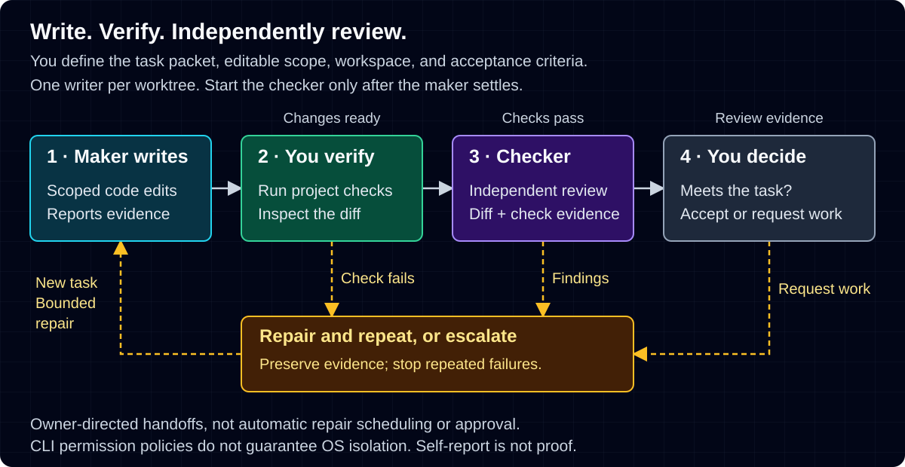

# Pache Lanes

Give a coding task to a **maker**, then ask a separate **checker** to review it.
Pache Lanes organizes the instructions, worker lifecycle, logs, and verification
for your existing agent CLIs. It is the standalone Pachebot lane tooling,
not a model service or a replacement for your agent's own CLI.

## What is a lane?

A **lane** is a named task record: its instructions (the **task packet**), role,
working directory, worker details, output, and status. A live lane runs an agent;
a dry-run lane only saves the packet so you can inspect the setup first.

The **workspace** is the repository or directory where that task happens.
Use an isolated git worktree for real edits, with only one maker writing to it.
Pache Lanes does not create worktrees, merge changes, or approve a release.
A Herdr workspace is its terminal container; it is not an isolated git worktree.

## How the review loop works



1. You define the objective, editable scope, and checks in a task packet.
2. The **maker** changes code and reports the files and commands it used.
3. You run deterministic checks: repeatable commands such as project tests.
4. After the maker settles, a separate **checker** reviews the diff and evidence.
5. You decide whether the result meets the task; a worker's claim is not proof.

If a check or review fails, preserve the evidence and give the maker a bounded
repair task, then check and review again. Escalate repeated failures instead of
looping indefinitely. `--max-repairs` is prompt guidance, **not an automatic
repair scheduler**. The diagram describes your workflow, not automatic approval.

## When is it useful?

- A scoped bug fix or feature needs a second review before you accept it.
- You want separate tasks in separate worktrees, with readable status and logs.
- You need an explicit handoff listing edits, checks, and unresolved risks.

It is not a guarantee of correct code, unattended completion, or safe isolation.
For a single quick edit, your usual agent CLI may be enough.

## Minimal install

From this checkout, use Python 3.10 or newer. The runtime has no Python dependencies.

```sh
python3 -m venv .venv
. .venv/bin/activate
python -m pip install .
pache-lane --help
```

This installs `pache-lane` and `pache-remote-lane` in that Python environment.
It does not install or log into agents, change Hermes, or enable remote access.
Keep standalone and original commands in separate PATH environments.

## Safe first run: no workers, no network

Run this in the checkout. Use a dedicated state directory outside `.hermes`;
choose an unused lane name if you already have `packet-demo`.

```sh
export PACHE_LANES_HOME="$HOME/.local/state/pache-lanes"
pache-lane create packet-demo --repo "$PWD" --agent claude \
  --role maker --prompt-file examples/maker.md --dry-run
pache-lane status packet-demo --json
pache-lane read packet-demo --log
pache-lane stop packet-demo
pache-lane remove packet-demo
```

Dry-run writes the packet and private local metadata only: no auth probe,
Herdr/tmux call, model, SSH connection, or credit spend. The log is empty because
no worker ran. This does not verify that your live backend or agent works.
Do not remove `--dry-run` until you have read the setup and permission guidance.

## Before launching real workers

**Tmux setup is mandatory before tmux workers:** follow
[first tmux initialization and private transport limits](docs/reference.md#first-tmux-initialization-explicit-no-agentnetwork).
The backend is how the worker runs: tmux for finite local jobs, or Herdr for an
interactive dedicated session. `auto` prefers Herdr (Copilot prefers tmux).
Read [runtime requirements](docs/reference.md#install) and the
[local maker/checker walkthrough](docs/reference.md#local-maker--independent-checker).

Authenticate your own agent CLI first; subscriptions and API charges are yours.
Real workers may spend credits or wait for permission approval. Claude checkers
use plan mode; Codex checkers use read-only policy. These are CLI policies,
**not guaranteed OS sandboxing**. Never expose production credentials or an
unrestricted SSH agent. Keep private prompts, logs, and evidence out of public issues.

Remote lanes are **experimental POSIX Claude over SSH/Herdr only**, fixture-tested
but not live-host E2E certified. Read the [remote setup and limits](docs/reference.md#remote-posix-claude-lanes-experimental)
before enabling a target. Remote completion markers can be spoofed; inspect and
test changes independently. No remote send/resume or Windows support is shipped.

## Detailed documentation

- [State, config, and privacy](docs/reference.md#safe-first-run-no-worker-no-network)
- [Tmux initialization and troubleshooting](docs/reference.md#first-tmux-initialization-explicit-no-agentnetwork)
- [Workers, verification, permissions, and cleanup](docs/reference.md#local-maker--independent-checker)
- [SSH and remote protocol](docs/reference.md#remote-posix-claude-lanes-experimental)
- [Compatibility and unsupported features](docs/reference.md#compatibility--release-scope)
- [Testing and release evidence](docs/reference.md#tests)

MIT licensed; [LICENSE](LICENSE) and [original attribution](NOTICE.md).
See [security guidance](SECURITY.md) and [contributing](CONTRIBUTING.md).
